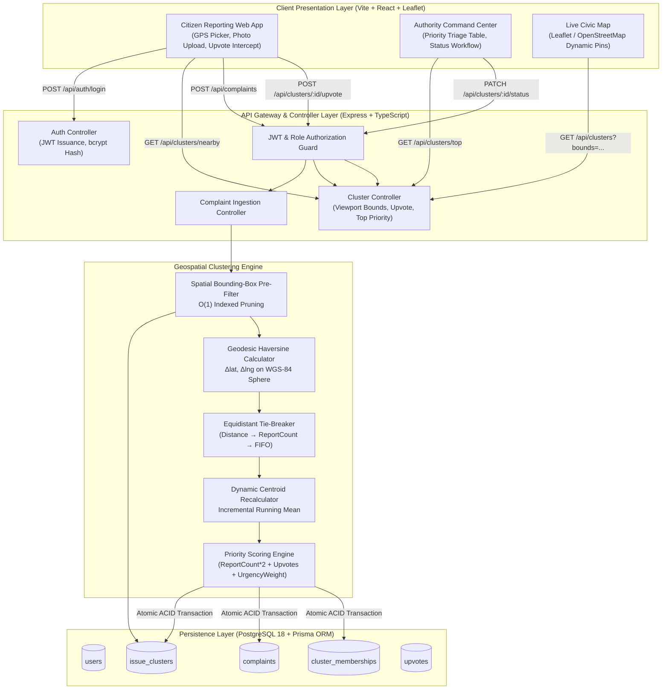

# High-Level Design Document (HLD)
## Project: Nivara — Civic Issue Clustering & Reporting Engine

---

## 1. System Overview & Architecture Diagram

Nivara is a full-stack, real-time civic issue reporting and spatial clustering platform. The system operates on a client-server architecture with an asynchronous, decoupled pipeline for spatial ingestion, candidate pruning, geodesic proximity calculation, and priority queue ranking.



---

## 2. System Components & Responsibilities

### 2.1 Citizen Client Application
- **Role**: Responsive web client (mobile and desktop) for incident reporting.
- **Responsibilities**:
  - Captures browser HTML5 Geolocation API coordinates or allows precision pinpoint placement on an interactive Leaflet map.
  - Implements proactive duplicate detection: debounces coordinate/category inputs and queries `GET /api/clusters/nearby`. If an active cluster is within $50\text{m}$, prompts citizen to upvote instead of submitting a duplicate ticket.
  - Handles photo uploads and description inputs.

### 2.2 Authority Command Center
- **Role**: Specialized triage interface for municipal ward engineers and field inspectors.
- **Responsibilities**:
  - Displays top civic hazards ranked dynamically by `priorityScore`.
  - Supports one-click status transitions (`OPEN` $\to$ `IN_PROGRESS` $\to$ `RESOLVED`).
  - Provides drill-down into any cluster to review chronological citizen reports, timestamps, and attached photos.

### 2.3 Express API Gateway & Controller Layer
- **Role**: RESTful interface providing request validation, security, and transaction routing.
- **Responsibilities**:
  - **Stateless JWT Authentication**: Issues signed tokens with role claims (`CITIZEN`, `AUTHORITY`).
  - **Payload Sanitization**: Validates GPS ranges ($\text{lat} \in [-90, 90]$, $\text{lng} \in [-180, 180]$) and category taxonomy.
  - **Atomic Transaction Wrapping**: Encloses clustering, complaint creation, and membership insertion inside PostgreSQL ACID transactions.

### 2.4 Geospatial Clustering Engine
- **Role**: High-speed mathematical core responsible for issue deduplication and spatial grouping.
- **Components**:
  1. **Bounding-Box Pre-Filter**: Translates the $50\text{m}$ search radius into latitude/longitude deltas ($\Delta\text{lat}, \Delta\text{lng}$), querying indexed database columns to prune distant clusters in $O(1)$ time.
  2. **Haversine Geodesic Distance**: Computes exact great-circle distance on the WGS-84 terrestrial sphere.
  3. **Category Isolation Guard**: Strictly isolates issues by category. Potholes never merge with sewage leaks.
  4. **Equidistant Tie-Breaker**: Resolves geometric ties deterministically:
     $$\text{Tie-break}: \min(\text{distance}) \implies \max(\text{reportCount}) \implies \min(\text{createdAt})$$
  5. **Dynamic Running Centroid**: Recalculates cluster coordinates in $O(1)$ time using running average without needing to re-fetch all historical points:
     $$\text{Centroid}_{N+1} = \frac{N \cdot \text{Centroid}_N + \text{Point}_{\text{new}}}{N + 1}$$

### 2.5 Relational Persistence Layer (PostgreSQL 18 + Prisma ORM)
- **Role**: ACID-compliant durable storage.
- **Features**:
  - Foreign key constraints with cascading deletes where appropriate.
  - Composite indexes on `(category, status)` and `(centroidLat, centroidLng)` to optimize spatial bounding-box lookups.
  - Unique composite index `(userId, clusterId)` on `upvotes` table to guarantee one vote per citizen per cluster.

---

## 3. Technology Stack Justification

| Layer | Chosen Technology | Alternatives Evaluated | Rationale & Justification |
| :--- | :--- | :--- | :--- |
| **Runtime & Backend** | **Node.js (v24 LTS) + Express (TypeScript)** | Python (Django / FastAPI), Java (Spring Boot) | - Excellent async I/O performance for high-concurrency ingestion.<br>- TypeScript provides end-to-end type safety between data contracts and API responses.<br>- Universal ecosystem compatibility with Prisma and Leaflet. |
| **ORM & Data Layer** | **Prisma ORM + PostgreSQL 18** | TypeORM, Sequelize, Raw pg driver | - Native schema-as-code migrations with zero boilerplate.<br>- Auto-generated strongly typed client preventing SQL injection.<br>- Native support for PostgreSQL transactions and compound indexes. |
| **Spatial Engine** | **Pure Mathematical Haversine + Bounding-Box** | PostGIS extension, Turf.js | - **Zero external binary dependencies**: Runs cleanly in any environment without requiring complex C/C++ GEOS/PROJ shared libraries.<br>- **Predictable sub-millisecond execution**: $O(1)$ bounding-box pruning reduces candidate set to $< 5$ clusters before Haversine is invoked.<br>- **Viva transparency**: Algorithm is 100% transparent and mathematically explainable during academic defense. |
| **Frontend Framework** | **React (Vite) + Tailwind CSS** | Vue, Angular, Next.js | - Blazing fast Vite HMR.<br>- Component-based modularity for map layers and triage tables.<br>- Lightweight single-page app architecture. |
| **Geospatial Mapping** | **Leaflet + OpenStreetMap** | Mapbox GL, Google Maps JS SDK | - Completely open source with zero API key or billing quotas.<br>- Lightweight and robust custom marker support for dynamic cluster sizing. |

---

## 4. Non-Functional Specifications & Design Goals

### 4.1 Latency & Throughput
- **Ingestion Latency**: Synchronous complaint ingestion and clustering evaluation target $< 50\text{ms}$ at the 95th percentile.
- **Viewport Map Query**: Bounding box queries for map tile loading execute in $< 20\text{ms}$ due to composite B-tree indexing on `(centroidLat, centroidLng)`.

### 4.2 Data Integrity & Concurrency Control
- To prevent race conditions during concurrent reports near the same cluster, updates are enclosed in a database transaction with row-level locks or atomic increment semantics:
  ```sql
  UPDATE issue_clusters 
  SET report_count = report_count + 1, 
      centroid_lat = :newLat, 
      centroid_lng = :newLng 
  WHERE id = :clusterId;
  ```

### 4.3 Scalability Roadmap (City-Scale Expansion)
For scaling to a metropolitan city with $> 100,000$ active monthly complaints:
1. **Spatial R-Tree Indexing via PostGIS**: Transition from Bounding-Box Prisma queries to PostGIS `geometry(Point, 4326)` with a GiST spatial index using `ST_DWithin`.
2. **Read-Replicas & Caching**: Cache active cluster pins in Redis Geo-sets (`GEOSEARCH`) for instant viewport retrieval.
3. **Stream Ingestion**: Decouple high-traffic ingestions via Apache Kafka or RabbitMQ with worker pools handling clustering asynchronously.
