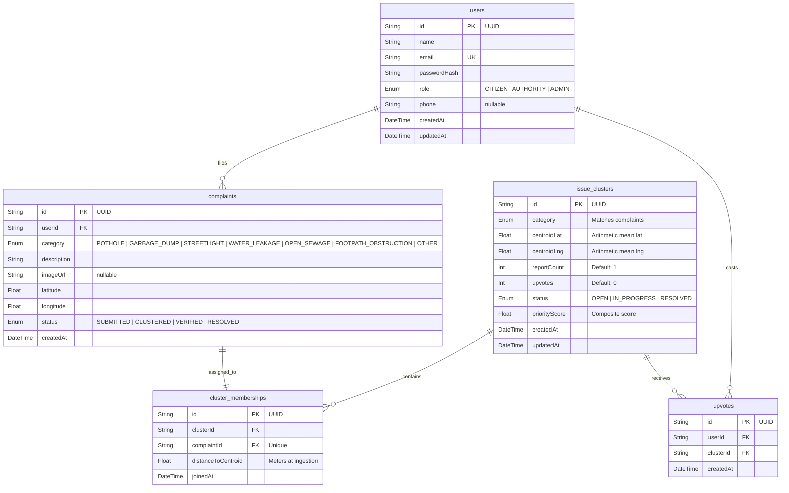

# Low-Level Design Document (LLD)
## Project: Nivara — Civic Issue Clustering & Reporting Engine

---

## 1. Database Schema & Entity-Relationship (ER) Model



### Table Index Definitions
- `issue_clusters`:
  - `idx_cluster_cat_status`: `(category, status)`
  - `idx_cluster_spatial`: `(centroidLat, centroidLng)`
- `complaints`:
  - `idx_complaint_cat`: `(category)`
  - `idx_complaint_spatial`: `(latitude, longitude)`
- `upvotes`:
  - `uq_user_cluster`: `UNIQUE(userId, clusterId)`
  - `idx_upvote_cluster`: `(clusterId)`
- `cluster_memberships`:
  - `uq_complaint`: `UNIQUE(complaintId)`
  - `idx_membership_cluster`: `(clusterId)`

---

## 2. Detailed Algorithm Walkthrough & Mathematical Proofs

### 2.1 The Spatial Bounding Box Pre-Filter ($O(1)$)
Calculating trigonometric functions for every active cluster in a city of $100,000$ reports would be $O(N)$ and computationally prohibitive. 
To optimize, we establish an envelope bounding box $(\text{minLat}, \text{maxLat}, \text{minLng}, \text{maxLng})$ around the query point $P(\phi, \lambda)$ using threshold radius $D = 50\text{m}$:

$$\Delta\phi = \frac{D}{R} \times \frac{180}{\pi}$$
$$\Delta\lambda = \frac{D}{R \cdot \cos(\phi \cdot \frac{\pi}{180})} \times \frac{180}{\pi}$$
$$\text{Bounding Box} = [\phi - \Delta\phi, \phi + \Delta\phi] \times [\lambda - \Delta\lambda, \lambda + \Delta\lambda]$$

Where $R = 6,371,000\text{ meters}$.
PostgreSQL evaluates this via indexed B-Tree ranges in sub-millisecond time, pruning $> 99.9\%$ of irrelevant clusters.

### 2.2 Geodesic Haversine Calculation
For all candidate clusters passing the bounding box check, we compute the true spherical surface distance:

$$\Delta\phi = \text{rad}(\phi_2 - \phi_1)$$
$$\Delta\lambda = \text{rad}(\lambda_2 - \lambda_1)$$
$$a = \sin^2\left(\frac{\Delta\phi}{2}\right) + \cos(\text{rad}(\phi_1)) \cdot \cos(\text{rad}(\phi_2)) \cdot \sin^2\left(\frac{\Delta\lambda}{2}\right)$$
$$c = 2 \cdot \text{atan2}\left(\sqrt{a}, \sqrt{1-a}\right)$$
$$d = R \cdot c$$

### 2.3 Incremental Running Centroid Recalculation ($O(1)$)
When a complaint $P_{N+1}(\phi_{N+1}, \lambda_{N+1})$ is attached to a cluster with $N$ existing reports and centroid $C_N(\bar{\phi}_N, \bar{\lambda}_N)$:

$$\bar{\phi}_{N+1} = \frac{N \cdot \bar{\phi}_N + \phi_{N+1}}{N + 1}$$
$$\bar{\lambda}_{N+1} = \frac{N \cdot \bar{\lambda}_N + \lambda_{N+1}}{N + 1}$$

This incremental formula avoids reading all historical complaint coordinates from disk, guaranteeing $O(1)$ time and $O(1)$ memory complexity.

### 2.4 Pseudocode: Complete Ingestion Pipeline

```text
Algorithm IngestAndCluster(P = {userId, category, description, lat, lng}):
    1. Begin Database Transaction
    2. [minLat, maxLat, minLng, maxLng] = CalculateBoundingBox(lat, lng, 50.0m)
    3. Candidates = DB.query("SELECT * FROM issue_clusters 
                             WHERE category = P.category 
                               AND status IN ('OPEN', 'IN_PROGRESS') 
                               AND centroidLat BETWEEN minLat AND maxLat 
                               AND centroidLng BETWEEN minLng AND maxLng")
    4. ValidMatches = []
    5. For each C in Candidates:
           dist = CalculateHaversineDistance([lat, lng], [C.centroidLat, C.centroidLng])
           If dist <= 50.0:
               ValidMatches.append({cluster: C, distance: dist})
               
    6. If ValidMatches is NOT empty:
           Sort ValidMatches by:
               1. distance ASC (primary)
               2. cluster.reportCount DESC (secondary tie-breaker)
               3. cluster.createdAt ASC (tertiary tie-breaker)
           SelectedCluster = ValidMatches[0].cluster
           
           NewCentroid = IncrementalCentroid(SelectedCluster.centroid, SelectedCluster.reportCount, [lat, lng])
           NewCount = SelectedCluster.reportCount + 1
           NewScore = (NewCount * 2.0) + (SelectedCluster.upvotes * 1.0) + CategoryWeight[P.category]
           
           Update SelectedCluster with NewCentroid, NewCount, NewScore
           Complaint = Insert into complaints (userId, category, description, lat, lng, status='CLUSTERED')
           Insert into cluster_memberships (clusterId=SelectedCluster.id, complaintId=Complaint.id, distance=ValidMatches[0].distance)
           Commit Transaction
           Return {complaint, cluster: SelectedCluster, isNewCluster: false}
    7. Else:
           InitialScore = (1 * 2.0) + (0 * 1.0) + CategoryWeight[P.category]
           NewCluster = Insert into issue_clusters (category=P.category, centroidLat=lat, centroidLng=lng, count=1, upvotes=0, score=InitialScore, status='OPEN')
           Complaint = Insert into complaints (userId, category, description, lat, lng, status='CLUSTERED')
           Insert into cluster_memberships (clusterId=NewCluster.id, complaintId=Complaint.id, distance=0.0)
           Commit Transaction
           Return {complaint, cluster: NewCluster, isNewCluster: true}
```

---

## 3. REST API Contract Specification

### 3.1 `POST /api/auth/register`
- **Request**:
  ```json
  {
    "name": "Aarav Sharma",
    "email": "aarav@example.com",
    "password": "password123",
    "role": "CITIZEN",
    "phone": "+91 9876543210"
  }
  ```
- **Response** `201 Created`:
  ```json
  {
    "success": true,
    "message": "Account created successfully",
    "data": {
      "user": { "id": "uuid", "name": "Aarav Sharma", "email": "aarav@example.com", "role": "CITIZEN" },
      "token": "eyJhbGciOi..."
    }
  }
  ```

### 3.2 `POST /api/auth/login`
- **Request**:
  ```json
  {
    "email": "aarav@example.com",
    "password": "password123"
  }
  ```
- **Response** `200 OK`:
  ```json
  {
    "success": true,
    "data": {
      "user": { "id": "uuid", "name": "Aarav Sharma", "email": "aarav@example.com", "role": "CITIZEN" },
      "token": "eyJhbGciOi..."
    }
  }
  ```

### 3.3 `POST /api/complaints` (Protected: `Bearer <token>`)
- **Request**:
  ```json
  {
    "category": "POTHOLE",
    "description": "Craters in front of Sony Signal causing traffic bottlenecks",
    "latitude": 12.935242,
    "longitude": 77.624461,
    "imageUrl": "https://example.com/pothole.jpg"
  }
  ```
- **Response** `201 Created`:
  ```json
  {
    "success": true,
    "message": "Complaint merged into existing cluster (18.42m from centroid)",
    "data": {
      "complaint": {
        "id": "c-uuid",
        "category": "POTHOLE",
        "description": "Craters in front of Sony Signal...",
        "latitude": 12.935242,
        "longitude": 77.624461,
        "status": "CLUSTERED"
      },
      "cluster": {
        "id": "cl-uuid",
        "category": "POTHOLE",
        "centroidLat": 12.935221,
        "centroidLng": 77.624399,
        "reportCount": 8,
        "upvotes": 0,
        "status": "OPEN",
        "priorityScore": 22.0
      },
      "isNewCluster": false,
      "distanceToCentroid": 18.42
    }
  }
  ```

### 3.4 `GET /api/clusters/nearby`
- **Query Params**: `lat=12.9352&lng=77.6244&category=POTHOLE`
- **Response** `200 OK`:
  ```json
  {
    "success": true,
    "data": {
      "hasNearbyCluster": true,
      "cluster": {
        "id": "cl-uuid",
        "category": "POTHOLE",
        "centroidLat": 12.935221,
        "centroidLng": 77.624399,
        "reportCount": 7,
        "upvotes": 3,
        "status": "OPEN",
        "priorityScore": 23.0
      },
      "distanceMeters": 21.3,
      "recentComplaints": [
        { "description": "Large pothole near median", "imageUrl": null, "createdAt": "2026-09-04T10:00:00.000Z" }
      ]
    }
  }
  ```

### 3.5 `GET /api/clusters?bounds=minLat,minLng,maxLat,maxLng`
- **Response** `200 OK`:
  ```json
  {
    "success": true,
    "count": 4,
    "data": {
      "clusters": [
        {
          "id": "cl-uuid",
          "category": "POTHOLE",
          "centroidLat": 12.935221,
          "centroidLng": 77.624399,
          "reportCount": 8,
          "upvotes": 3,
          "status": "OPEN",
          "priorityScore": 25.0
        }
      ]
    }
  }
  ```

### 3.6 `POST /api/clusters/:id/upvote` (Protected)
- **Response** `200 OK`:
  ```json
  {
    "success": true,
    "message": "Upvote recorded successfully. Issue priority elevated.",
    "data": {
      "cluster": {
        "id": "cl-uuid",
        "upvotes": 4,
        "priorityScore": 26.0
      }
    }
  }
  ```

### 3.7 `GET /api/clusters/top?limit=10&status=OPEN`
- **Response** `200 OK`: Returns top clusters ordered by `priorityScore DESC`.

### 3.8 `PATCH /api/clusters/:id/status` (Protected: `AUTHORITY` role)
- **Request**:
  ```json
  {
    "status": "IN_PROGRESS"
  }
  ```
- **Response** `200 OK`: Returns updated cluster object.
